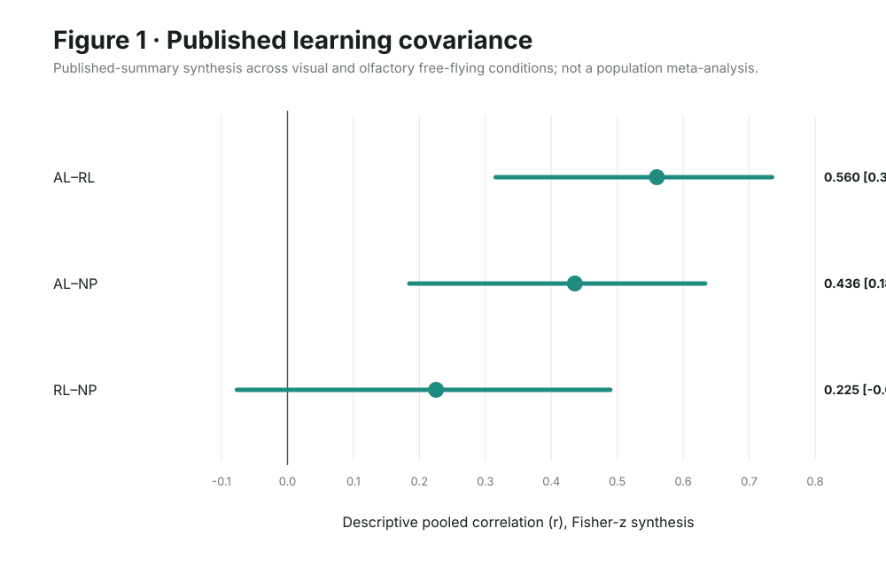
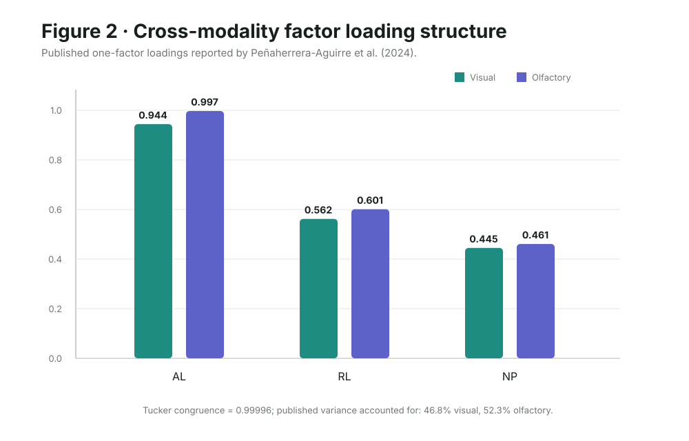
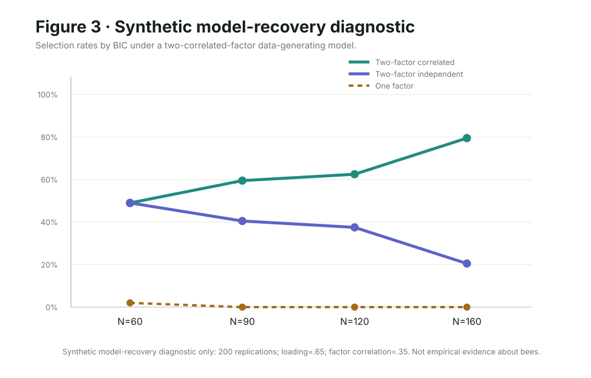
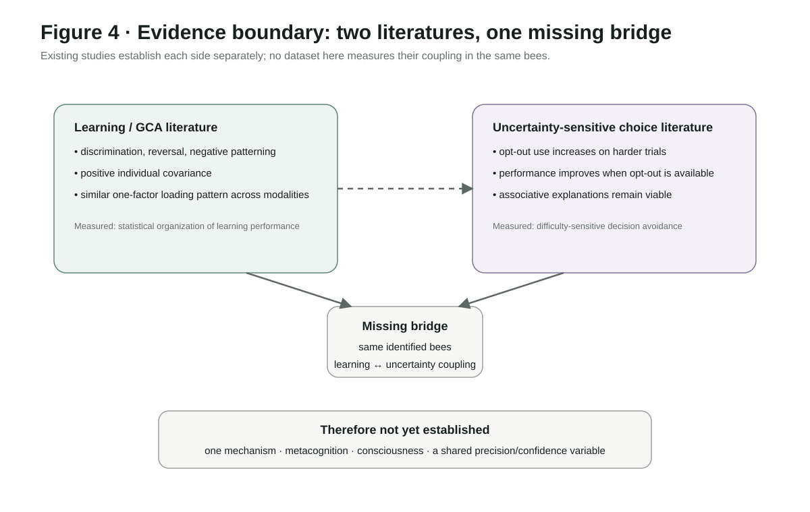
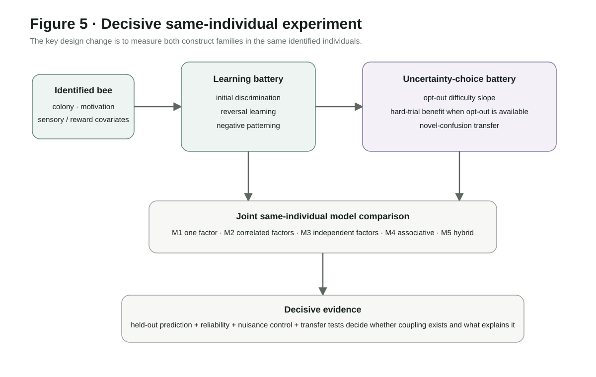

# 从蜜蜂的一般学习能力到不确定性监测

## 定量综合与可证伪模型比较框架

**Cochrane Kang**  
ARIS4C001 · 中文完整论文镜像 · 2026年9月18日

**英文投稿目标：** Frontiers in Psychology — Comparative Psychology  
**文章类型：** Hypothesis and Theory  
**说明：** 本中文版本与英文 canonical manuscript 保持相同的证据边界。参考文献、变量名与部分技术术语保留英文，以避免歧义。

### 摘要

蜜蜂（*Apis mellifera*）为研究个体稳定认知差异提供了一个可操作的比较认知模型：这些差异究竟反映领域一般性的能力、较窄的认知专长，还是特定任务中的局部学习过程？与此相关的两条研究传统长期相对分离。一类学习任务研究显示，蜜蜂在初始辨别、反转学习和负模式学习之间存在正向个体协变；另一类 opt-out 实验则表明，蜜蜂会适应性地回避困难选择。本文在严格区分“协变结构”和“机制解释”的前提下综合这两类证据。基于 Finke et al. (2023) 两个自由飞行条件所报告的相关系数进行描述性 Fisher-z 综合，初始辨别与反转学习的跨条件相关约为 0.56，初始辨别与负模式学习约为 0.44，反转学习与负模式学习约为 0.23。Peñaherrera-Aguirre et al. (2024) 报告的视觉与嗅觉条件因子载荷向量几乎完全一致（Tucker congruence = 0.99996），支持学习表现中存在可重复的统计结构。然而，学习研究与 opt-out 研究并未在同一只蜜蜂上测量这两类表型，因此现有证据不能证明二者由同一个潜在机制连接。本文形式化五个竞争模型：单一一般因子、两个相关因子、两个独立因子、任务局部的联结学习模型，以及混合模型。透明的 synthetic model-recovery 诊断进一步表明，小样本很难区分相近的潜变量结构。当前最强结论因此比“蜜蜂具有一般智力”或“蜜蜂具有元认知”更窄：蜜蜂表现出可重复的学习任务间个体协变，也表现出对决策难度的适应性敏感，但连接这两者的耦合关系和机制尚未被直接测量。本文最后提出一个同一个体、多任务的决定性实验设计。

**关键词：** *Apis mellifera*；一般认知能力；个体差异；不确定性监测；元认知；联结学习；比较认知；潜变量模型

---

## 1. 引言

动物认知中的个体差异并非围绕物种平均水平的“噪声”。稳定的个体间差异可以帮助我们理解认知性状如何组织、受到哪些约束，以及它们可能如何受到选择作用。蜜蜂尤其适合这类问题：同一个体可以连续完成多个可控学习任务，同时其神经生物学与行为机制已有较丰富研究基础。

核心的心理测量问题是：不同任务之间的表现为何相关？一种可能是个体具有较为领域一般性的认知资源；另一种可能是若干较窄能力彼此相关；还可能只是不同任务共享了动机、知觉、强化史或程序要求。在蜜蜂研究中，两类证据都存在。Finke et al. (2021) 发现视觉域内部存在稳定的个体表现，但视觉学习水平不能预测对应的嗅觉元素学习表现，提示存在专门化。Finke et al. (2023) 随后在视觉与嗅觉的自由飞行实验中发现，简单辨别、反转学习和负模式学习之间存在正向个体协变。Peñaherrera-Aguirre et al. (2024) 对这些数据进行平行分析与探索性因子分析，在两个感觉条件中都报告了一个一般因子。

第二条研究传统关注另一个问题：蜜蜂是否会对自身的不确定性做出适应性反应。Perry and Barron (2013) 训练自由飞行蜜蜂完成带有 opt-out 路径的辨别任务。蜜蜂在困难试次中更常选择退出，并且当允许退出时，在困难试次上的表现更好。完成长程序的 10 只蜜蜂中，有 4 只在首次呈现新的混淆刺激时就选择退出，显示一定程度的迁移。然而，作者同时保留了联结学习解释：困难刺激可能获得较低期望价值，而退出反应本身获得回避价值。

最诱人的理论跳跃，是立即把这两条文献连接起来：也许一个“precision”“confidence”或一般认知因子同时解释学习能力和不确定性敏感选择。但这一跳跃目前缺乏直接数据。学习协变与 opt-out 的适应性都是真实的经验现象，但它们来自不同数据集、不同个体和不同推断目标。仅凭它们在同一物种中同时存在，无法推出同一个机制。

本文有四个目标。第一，保守地区分学习协变、元认知解释、联结学习替代解释和意识相关主张。第二，对两个自由飞行学习条件进行可复现的 summary-statistic 综合，并量化发表因子结构的跨感觉相似性。第三，把不同解释形式化为真正可以相互竞争、能够失败的模型。第四，提出一个能直接测量二者耦合关系的同一个体实验。

---

## 2. 证据基础与构念边界

### 2.1 蜜蜂认知表现的个体一致性

Finke et al. (2021) 检验了个体表现是否可以跨任务复杂度和感觉模态泛化。结果显示，一些蜜蜂在视觉任务中持续表现较好，但视觉元素学习能力不能预测对应的嗅觉元素学习能力。这一点十分重要，因为它说明“所有认知任务天然形成正向流形”并非蜜蜂数据的必然属性。

Finke et al. (2023) 使用包括初始辨别/联结学习（AL）、反转学习（RL）和负模式学习（NP）在内的学习任务组。在视觉自由飞行条件下，AL–RL 的 Spearman 相关为 0.53（n=27），AL–NP 为 0.42（n=33），RL–NP 为 0.25（n=27）。嗅觉条件对应值为 0.60（n=20）、0.46（n=22）和 0.19（n=20）。前两组关系在两个模态中均较稳定，而 RL–NP 较弱。需要特别注意的是，进入第二阶段反转学习分析要求个体先完成初始习得，因此样本构成本身带有选择过程。

Peñaherrera-Aguirre et al. (2024) 对这些矩阵进行因子分析。视觉条件的载荷为 AL=0.944、RL=0.562、NP=0.445；嗅觉条件为 0.997、0.601、0.461。因子分别解释 46.8% 和 52.3% 的表现方差。这些结果说明协变具有结构，但三指标单因子解并不等价于一个生物学上单一的机制。

### 2.2 不确定性敏感选择

Perry and Barron (2013) 表明蜜蜂会根据试次难度调整 opt-out 使用。在长难度阶段中，完成全部 50 个试次的 10 只蜜蜂在困难试次中更常退出；在可以退出的困难试次中，最终选择的准确率也高于被迫作答的困难试次。后续迁移中，一部分蜜蜂会在新型混淆刺激出现时立即退出。

这些结果足以支持“难度敏感的决策回避”，但还不足以唯一识别其计算机制。因此本文用 **uncertainty-sensitive choice（不确定性敏感选择）**描述行为事实，而把“metacognition（元认知）”保留为需要排除更低层次替代解释后才能支持的机制性解释。

### 2.3 意识与自我意识是独立问题

近期昆虫意识综述把预测、注意、情绪样状态、自我相关加工和元认知等都视为可能有关的证据来源，但没有任何单一行为任务可以直接确立主观体验。本文因此不从学习协变或 opt-out 行为推出蜜蜂具有现象意识或自我意识。类似地，复杂社会学习可以证明文化传递能力，却不能自动成为自我意识或单一“precision”变量的证据。

---

## 3. 已发表学习协变的定量综合

### 3.1 数据

分析仅使用已发表 summary statistics。Finke et al. (2023) 两个自由飞行条件中的三组 Spearman 相关及其样本量被转录；Peñaherrera-Aguirre et al. (2024) Table 1 的因子载荷与解释方差被用于跨模态结构比较。

这是一项**描述性的跨条件综合**，不是总体层面的 meta-analysis。条件仅有两个，且来自相关研究程序；不同任务对的样本量也受反转学习筛选规则影响。

### 3.2 跨条件相关综合

对每一任务对使用 Fisher-z 变换，以 n−3 加权，然后变换回 r。

| 任务对 | 视觉 rho (n) | 嗅觉 rho (n) | 描述性 pooled r | 近似 95% 区间 |
|---|---:|---:|---:|---:|
| AL–RL | 0.53 (27) | 0.60 (20) | **0.560** | 0.316–0.735 |
| AL–NP | 0.42 (33) | 0.46 (22) | **0.436** | 0.185–0.633 |
| RL–NP | 0.25 (27) | 0.19 (20) | **0.225** | −0.077–0.489 |

这一结构并不对称：初始辨别与反转、负模式学习都具有中等关联，而反转与负模式学习的关系明显更弱。因此数据支持某种正向协变结构，却不支持“所有任务近似等强相关”的简单版本。

### 3.3 跨模态因子一致性

两个载荷向量的 Tucker congruence 为 **0.99996**，说明相对载荷结构几乎完全一致。在两个条件中，AL 都是最强载荷，随后是 RL 和 NP。视觉条件下，单因子载荷乘积几乎完全重建三个相关系数；嗅觉条件下，对 AL–RL 与 AL–NP 的重建也很接近，但 RL–NP 的隐含相关约 0.277，而观测值为 0.19。

这说明因子可以非常紧凑地概括协方差，但并不能唯一说明协方差的生物学来源。

---

## 4. 竞争模型

本文把五个模型作为真正的竞争者。

**M1：单一一般因子。** 学习与不确定性敏感指标共同加载到一个潜因子上。

**M2：两个相关因子。** 学习指标加载到 G，不确定性控制指标加载到 U，并估计 rho(G,U)。

**M3：两个独立因子。** 与 M2 相同，但 rho(G,U)=0。

**M4：任务局部的联结学习模型。** opt-out 由刺激难度、近期奖惩、刺激泛化、退出反应价值及决策噪声产生，不要求元认知状态。

**M5：混合模型。** 稳定个体差异影响基础学习效率或决策质量，同时 trial-level opt-out 主要由联结价值计算生成。

所谓 predictive precision 或 confidence-like 潜变量可以保留为探索性候选，但不享有先验优先地位，也不能预设其神经定位或与表现之间的符号关系。

---

## 5. 模型恢复诊断

在收集决定性数据之前，需要知道现实样本量是否足以区分潜变量模型。synthetic simulation 从两个相关潜因子生成六个标准化指标，载荷设为 0.65、因子相关设为 0.35；随后以 BIC 比较单因子、两个相关因子和两个独立因子模型。每个样本量运行 200 次重复，N 分别为 60、90、120、160。

这一分析**不是蜜蜂的经验数据**，只用于实验设计。

在设定场景下，两个相关因子模型的选择率从 N=60 时约 49%，提升到 N=90 时 59.5%、N=120 时 62.5%、N=160 时 79.5%。因此二三十只个体虽然可能足以观察某些 pairwise correlation，却不太可能稳定区分细微的 latent coupling。

**图 4｜两条证据链之间的边界。** 现有研究分别支持结构化学习协变和难度敏感的 opt-out 行为，但缺少“同一只蜜蜂身上两类表型如何耦合”的直接证据。因此，不能仅凭物种层面的共存推断单一机制、元认知、意识或共享的 precision/confidence 变量。

---

## 6. 决定性的同一个体实验

关键实验必须在**同一批可识别蜜蜂**上同时测量学习协变和不确定性敏感选择。一个紧凑 battery 应包含：初始辨别、反转学习、负模式学习、opt-out difficulty slope、允许退出时困难试次准确率的改善，以及退出策略的迁移/泛化。

至少应由六个 colony 提供个体。需要保留 colony、任务顺序、刺激身份、奖励敏感性、决策潜伏期和 attrition。任务顺序应随机化或 counterbalance；如果完整 battery 负担过大，应优先使用 planned-missingness，而不是让无控制的流失决定最终分析样本。

confirmatory analysis 应使用 held-out predictive performance、calibration 和 posterior predictive checks 比较 M1–M5。对 opt-out 行为，可用 hierarchical logistic model 建模 trial difficulty 与 reinforcement history，同时允许 bee-level 与 colony-level variation。在联结学习 baseline 尚未指定前，不应直接加入抽象的 latent uncertainty term。

主要 falsifier 也应提前写清：若 uncertainty 指标具有可靠个体差异但与 learning/GCA 的潜在相关接近 0，M1 会被削弱；若 learned value 与 stimulus similarity 不能解释 opt-out 的迁移，则纯 M4 会被削弱；若控制 reliability 和 selection 后跨任务协变消失，广义 GCA 解释会被削弱；若不同任务需要不同 latent parameter 或更简单模型预测同样好，则 unitary precision account 会被削弱。

**图 5｜决定性的同一个体实验。** 新设计在同一批可识别蜜蜂上同时测量学习和不确定性敏感选择，并保留关键 nuisance variables，再通过 held-out prediction、reliability、calibration 与 transfer 对 M1–M5 进行竞争比较。该图把当前文献中缺失的推断桥梁直接可视化。

---

## 7. 讨论

### 7.1 当前证据真正支持什么

当前最强证据支持的是**蜜蜂认知中的结构化个体差异**。两个自由飞行感觉条件中，初始辨别表现与反转学习、负模式学习均存在中等协变；单因子载荷结构在视觉和嗅觉条件中高度一致。把这些协变全部视为随机噪声已经不合理。

同时，另一个独立文献支持**适应性的难度敏感选择**：蜜蜂会随难度改变 opt-out 使用，并能在困难条件下从退出选项中获益。

这两点都成立。科学上的错误，是把它们自动变成第三点——“同一个个体层机制导致两者”。

### 7.2 为什么 GCA 应被视为统计假设，而非机制标签

一般因子可以来自单一公共资源，也可能来自多个相关过程、发育质量、动机稳定性、共同任务结构或它们的混合。因子分析组织协方差，并不自动识别其生物学原因。

2021 年的跨感觉分离尤其重要：如果一个体在视觉任务中稳定表现较好，却不能在等价嗅觉任务中表现出对应优势，那么“general”究竟发生在哪一层级必须被明确。更合理的解释可能是层级性的：蜜蜂存在比单任务更宽、但比全局一般智力更窄的稳定个体差异。

### 7.3 为什么不能默认把 opt-out 称为元认知

Perry and Barron 的行为结果很有说服力，尤其是困难试次选择性退出和一定程度的迁移。但如果还没有让联结学习模型真正参与预测竞争，就直接把行为定义为“元认知”，实际上是在用术语替代证据。

本文并不是主张蜜蜂没有元认知，而是要求一个更强的检验。即使未来发现 GCA 与 uncertainty-sensitive control 之间存在稳定同一个体协变，也仍不能单独证明 introspection，但会显著限制可行机制范围。

### 7.4 与昆虫意识的关系

本综合与更广泛的昆虫意识论证可以相容，但不能单独建立意识结论。学习协变、不确定性敏感选择、自我相关加工、社会学习和主观体验必须保持概念区分。

### 7.5 predictive-coding 想法还剩下什么

precision-like 解释仍可以成为有价值的风险性模型：它可以预测 confidence、learning rate、choice stochasticity 与 opt-out 如何跨任务协变。但参数必须从数据估计，并与更简单的联结模型、潜因子模型进行 out-of-sample 比较；神经定位则需要独立验证。

这样，predictive coding 才是一个可失败的 hypothesis generator，而不是循环解释。

---

## 8. 局限

第一，本文使用的是已发表相关系数和因子载荷，并未独立下载并重新处理 Finke 原始数据，因此明确属于 summary-statistic synthesis。

第二，描述性 pooling 仅包含同一相关研究程序中的两个感觉条件，不能被解释为“所有蜜蜂认知”的总体 meta-analytic effect。

第三，三个学习指标对于潜变量结构推断仍然偏少。更广的任务 battery、重复测量和显式 reliability estimate 会使 GCA、相关能力与共同任务需求之间的区分更可信。

第四，目前没有任何本文纳入的数据集在同一个体上同时测量 learning/GCA 与 opt-out uncertainty。因此本文没有估计 rho(G,U)，也没有报告连接两类构念的 bee-level effect。

第五，模型恢复练习依赖一个刻意简化的 synthetic scenario，只用于说明 identification 难度，不是特定生物实验的 power analysis。

---

## 9. 结论

蜜蜂目前提供两类相互独立但都可靠的认知结构证据：学习任务之间可重复的个体协变，以及对决策难度的适应性敏感。已发表学习数据表现出正向但不均匀的相关结构，视觉与嗅觉条件中的因子载荷又高度一致；opt-out 文献则表明蜜蜂能够适应性地回避困难选择，但这种行为究竟由元认知还是联结机制驱动仍然开放。

真正缺少的是两者之间的桥梁。

下一步决定性研究不应再从某个偏好的机制出发做循环模拟，而应在同一批个体中同时测量一般学习结构和 uncertainty-sensitive control，并强迫竞争模型预测 held-out behavior。在这座桥真正被测量之前，“一般认知能力”“元认知”“precision”和“self-awareness”应保持为彼此不同的假设。

更窄的结论反而更强，因为它明确说明了我们已经知道什么、尚不知道什么，以及什么观察结果会改变答案。

---

## 数据、代码与可复现性

本文没有收集新的动物数据。summary-statistic synthesis、factor-congruence calculation 和 synthetic model-recovery diagnostic 均保存在 ARIS4C001 仓库中。所有用于图表的数值均来自已提交的 machine-readable JSON，并保留来源说明。

Finke et al. (2023) 的公开原始数据据作者说明存放于 Figshare（doi:10.6084/m9.figshare.20473113.v）。本文不声称完成了独立 raw-data replication。

## 伦理声明

本文未开展新的动物实验。

## 利益冲突

作者声明无利益冲突。

## 经费

本综合未报告特定经费支持。

## 作者贡献

C.K.：概念构建、证据综合、方法学、定量 summary analysis、模型 specification、写作与仓库维护。

---

## 参考文献

Barron, A. B., & Klein, C. (2016). What insects can tell us about the origins of consciousness. *PNAS*, 113, 4900–4908. https://doi.org/10.1073/pnas.1520084113

Boogert, N. J., Madden, J. R., Morand-Ferron, J., & Thornton, A. (2018). Measuring and understanding individual differences in cognition. *Philosophical Transactions B*, 373, 20170280. https://doi.org/10.1098/rstb.2017.0280

Bridges, A. D., Royka, A., Wilson, T., et al. (2024). Bumblebees socially learn behaviour too complex to innovate alone. *Nature*, 627, 572–578. https://doi.org/10.1038/s41586-024-07126-4

Cauchoix, M., Chow, P. K. Y., van Horik, J. O., et al. (2018). The repeatability of cognitive performance: a meta-analysis. *Philosophical Transactions B*, 373, 20170281. https://doi.org/10.1098/rstb.2017.0281

Chittka, L., Skeels, S., Dyakova, O., & Janbon, M. (2025). The exploration of consciousness in insects. *Philosophical Transactions B*, 380, 20240302. https://doi.org/10.1098/rstb.2024.0302

Finke, V., Baracchi, D., Giurfa, M., Scheiner, R., & Avarguès-Weber, A. (2021). Evidence of cognitive specialization in an insect. *Journal of Experimental Biology*, 224, jeb242470. https://doi.org/10.1242/jeb.242470

Finke, V., Scheiner, R., Giurfa, M., & Avarguès-Weber, A. (2023). Individual consistency in the learning abilities of honey bees. *Animal Cognition*, 26, 909–928. https://doi.org/10.1007/s10071-022-01741-2

Kuklovsky, V., Avarguès-Weber, A., Giurfa, M., et al. (2026). Visual learning performance in free-flying honey bees is independent of sucrose and light responsiveness and depends on training context. *Scientific Reports*, 16, 1319. https://doi.org/10.1038/s41598-025-34900-9

Peñaherrera-Aguirre, M., Sarraf, M. A., Woodley of Menie, M. A., & Figueredo, A.-J. (2024). Possible evidence for the Law of General Intelligence in honeybees. *Intelligence*, 106, 101856. https://doi.org/10.1016/j.intell.2024.101856

Perry, C. J., & Barron, A. B. (2013). Honey bees selectively avoid difficult choices. *PNAS*, 110, 19155–19159. https://doi.org/10.1073/pnas.1314571110

Smith, J. D., Couchman, J. J., & Beran, M. J. (2014). Animal metacognition: a tale of two comparative psychologies. *Journal of Comparative Psychology*, 128, 115–131. https://doi.org/10.1037/a0033105

Smith, J. D., Zakrzewski, A. C., & Church, B. A. (2016). Formal models in animal-metacognition research. *Psychonomic Bulletin & Review*, 23, 1341–1353.
