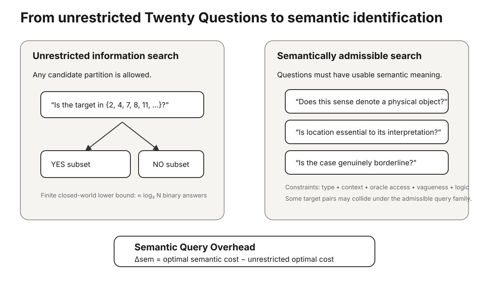
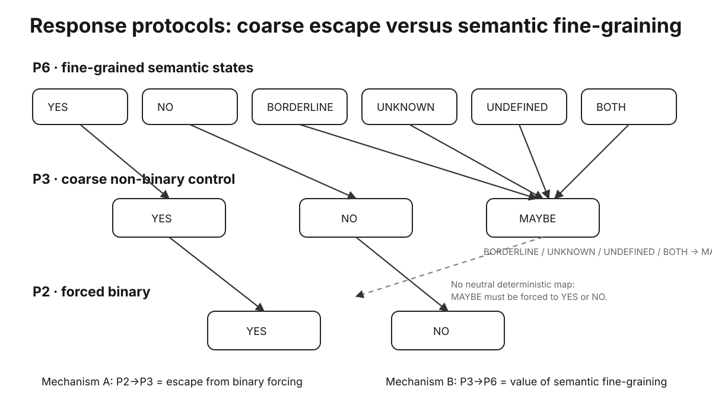

# 超越“二十问”：普适概念识别的语义边界与查询复杂度

**结果前论文骨架**  
**ARIS4C010**  
**作者：Cochrane Kang**

> 本文档刻意停留在“结果前”状态。Pilot 0–2 仅作为探索性/工程性证据；在人类校准与 Benchmark v0 冻结前，不写入确认性结论。

## 摘要

经典“二十问”可以被看作一个信息论问题：若允许任意、无噪声的二元划分，(N) 个等概率候选通常只需约 (log_2 N) 个问题即可区分。但真实的人类语义提问受到更强限制：问题必须可理解、适用于目标类型、能在给定语境与回答者条件下作答，并能处理歧义、模糊性、不存在对象、矛盾、未知事实与开放世界目标。本文将**语义概念识别**形式化为：在明确的候选概念空间中，使用受限的可接受语义问题进行自适应搜索；并定义 **Semantic Query Overhead（语义查询额外成本）**，即语义受限条件相对于任意信息论划分所增加的识别成本。我们区分“静态最小区分问题集”与“自适应决策树”，并使用多轴、类型化的概念表示，而不假设所有概念都能放入一棵单一继承树。一个基于 15 个 Open English WordNet 真实词义的探索性 Pilot 显示，在尚未经人工校准的问题矩阵上，可观察到小但非零的语义查询额外成本。后续确认性研究将通过人类标注比较 P2、P3 与 P6 回答协议，并系统比较单一分类树、语义图、多轴表示、向量嵌入和混合模型。

## 1. 引言

“二十问”的核心是：隐藏一个目标，然后连续提出问题缩小候选空间。如果允许任意划分，那么问题本质上接近编码。然而自然语言中的语义问题并不能随意构造。例如，“你的概念是不是第 1、4、7、13……号候选之一？”在数学上可能高效，但通常不能被认为是一个自然的概念问题。

因此本文关注的核心不是“怎样做一个更强的猜词游戏”，而是：

> **当问题必须具有合法、可理解、可回答的语义结构时，识别目标需要额外付出多少查询成本？**

这一问题不等同于先构造一棵“万物分类树”。精确识别真正需要的是：相对于给定候选宇宙，问题族能区分任意两个候选。单一 `is-a` 树对普通实体分类很有用，但词义、关系、否定、语境依赖、虚构/空指称、高阶概念与语义悖论会跨越分类继承关系。

因此，本项目中的“普适”始终是相对的：相对于明确的目标空间、问题语言、回答协议、语境模型与 oracle。\n\n

## 2. 形式框架

设 (C) 为候选目标集合，(Q) 为允许的问题集合，(R) 为回答状态集合，(A(c,q,x)) 为语境 (x) 下目标 (c) 对问题 (q) 的理想化回答。

对有限 (C)，只有当任意两个不同目标至少能被某个合法问题区分时，精确识别才可能实现。

若每个问题最多有 (r) 个回答分支、最多提问 (b) 次，则决策树至多拥有 (r^b) 个叶节点。因此，在有限回答字母表下，不可能对无限候选集合给出统一的有限最坏情况上界。

### 2.1 静态区分与自适应识别

静态问题基寻找最小问题子集，使所有候选的联合回答签名不同。在确定性二元情形下，它可以映射为 Test Cover。

自适应策略则根据前面得到的回答选择下一问。最小静态问题基与最短/最低成本的自适应决策树是两个不同的优化对象。

### 2.2 语义查询额外成本

设 (L^*_{all}) 是允许任意划分时的最优期望成本，(L^*_{sem}) 是只允许语义合法问题时的最优期望成本：

[
Delta_{sem}=L^*_{sem}-L^*_{all}.
]

在单位成本的二元任意划分条件下，期望最优值可以使用目标先验上的 Huffman 最优前缀码长度表示。

## 3. 概念表示

UCID 使用类型化、多轴因子分解，而不宣称存在唯一、终极的概念分类树。当前维度包括：

1. 目标/表征层级；
2. 本体类型；
3. 逻辑/组合形式；
4. 指称与模态状态；
5. 边界与渐变性；
6. 语境依赖；
7. grounding / 获取方式；
8. 认识论与可计算性状态；
9. 自指与语义异常；
10. 词汇化与可表达性。

经验问题不是“这些轴是否构成唯一正确的形而上学”，而是：这些跨切语义结构是否能在 held-out 目标上提高区分率、减少非法问题，并改善查询效率。

## 4. 回答协议

P2 只有 YES / NO。

P3 为 YES / NO / MAYBE。它是一个粗粒度的非二元机制对照：MAYBE 刻意把“为什么不适合给出确定二元答案”的各种原因合并在一起。

P6 区分：
YES、NO、BORDERLINE、UNKNOWN、UNDEFINED、BOTH。

P6+context 进一步允许 CONTEXT_REQUEST。

关键机制检验不再只是 P2 对 P6。P2→P3 估计“允许任何非二元逃生答案”的价值；P3→P6 估计“进一步区分不同语义失败原因”的增量价值。更丰富的回答字母表理论上可以保留更多信息，但也可能带来更高认知负担和更差一致性。\n\n

## 5. 既有研究边界

本项目直接建立在以下成熟领域之上：精确查询学习、广义二分搜索、Test Cover / separating systems、teaching dimension、指称表达生成、描述逻辑概念学习、本体不可分性、RSA/语用参照游戏、主动特征获取、澄清问题生成、词汇本体、形式概念分析、模糊语义学、非经典逻辑与开放世界识别。

因此，论文不能把“信息增益提问”“做一个 ontology”或“找最小区分属性集”当作核心创新。

候选贡献在于：把这些组件整合为一个显式测量**语义合法性成本**、覆盖异质概念类型与不可识别边界的统一 benchmark。

## 6. 方法

### 6.1 证据阶梯

Pilot 0：纯组合模拟，用于验证算法实现。

Pilot 1：构造的异质概念 seed，用于检验粗分类树产生的回答签名碰撞。

Pilot 2：第一次引入真实 Open English WordNet 词义，并严格分离 source-native 信息与尚未人工校准的 UCID 映射。

### 6.2 Lexical Calibration60

第一批人类校准 source pool 固定使用 Open English WordNet 2025，并通过 `wn==1.1.1` 读取。

十个高多义 lemma 各抽取六个名词义项：

bank、spring、head、line、point、light、field、board、foot、case。

同一 lemma 的所有义项始终作为一个 leakage group。

24 个通用语义问题在设计时不针对具体 gloss 定制。平衡抽样后形成 720 个初始人类校准 target-query pair。

### 6.3 Mixed response-state calibration

另有 24 个构造场景，专门检验 BORDERLINE、UNKNOWN、UNDEFINED、BOTH 等状态是否能被参与者稳定区分。场景覆盖：模糊性、缺失语境、空指称、虚构、矛盾、自指、随机未来、不可判定与 oracle 获取限制等。

任何回答都不会预先被写成 gold。

### 6.4 人类 form 设计

36 个平衡 base forms 分别复制为 P2、P3 与 P6，共 108 个 form。

每个 form 包含 84 个唯一主试次和 8 个 covert retest。完整跑一轮 forms 可以获得均衡的 pair 覆盖，但 108 并不等于正式功效分析后的样本量建议。

## 7. 探索性工程结果

### 7.1 Pilot 2

Pilot 2 使用 15 个真实 OEWN 名词义项：`bank` 9 个、`spring` 6 个。

仅使用 OEWN `lexname` 时仍存在 5 组回答签名碰撞，对应 pairwise separation coverage = 0.9143。

加入 18 个探索性通用语义问题后，15 个目标均获得唯一签名；其中精确最小静态区分子集包含 12 个问题。

在均匀先验下：

- 任意二元划分的 Huffman 最优期望成本：3.9333；
- 语义问题的精确最优期望成本：4.2667；
- 探索性平均 Semantic Query Overhead：+0.3333 问；
- 任意二元划分最坏情况：4；
- 语义问题精确最坏情况：6；
- 探索性最坏情况额外成本：+2 问。

因为语义回答矩阵尚未经过人类校准，这些数值不能作为确认性结论。

## 8. 确认性结果——保留

本节只写入冻结后的 Benchmark v0 与人类校准结果。

主要结果包括：
- pairwise separation coverage；
- collision class 结构；
- 期望/最坏情况查询成本；
- Semantic Query Overhead；
- 非法/类型错误问题率；
- P2/P3/P6 一致性和 retest；
- open-world calibration。

## 9. 讨论——预先固定的解释边界

若结果支持多轴表示，也不能据此宣称得到“人类思想的终极 ontology”；只能说明在指定目标空间和问题协议下，该表示提高了可识别性。

若简单 lexical graph 或 embedding 与多轴表示相当，则应直接缩小论文结论。

若 P6 相比粗粒度 P3 的 MAYBE 对照没有足够增量收益，应简化回答协议，而不是为了理论美感强行保留。

真正的 strong ineffability 仍然属于任务可表征性的边界，而不是 benchmark 中一个普通数据行。

## 数据与代码

当前所有设计、source lock、schema、Pilot、CI、校准构建器与分析脚本均版本化保存于 ARIS4C 的 `papers/010-universal-concept-identification/`。
