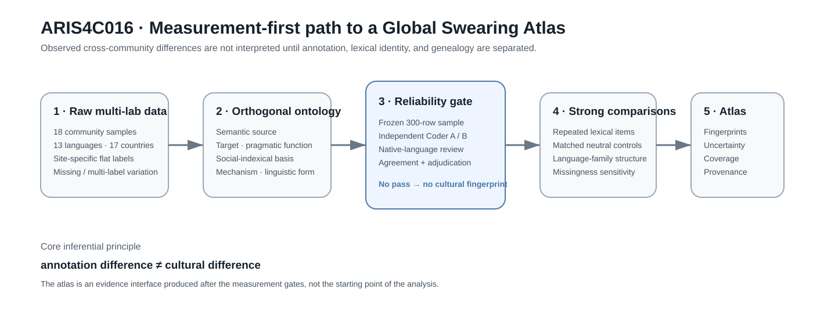
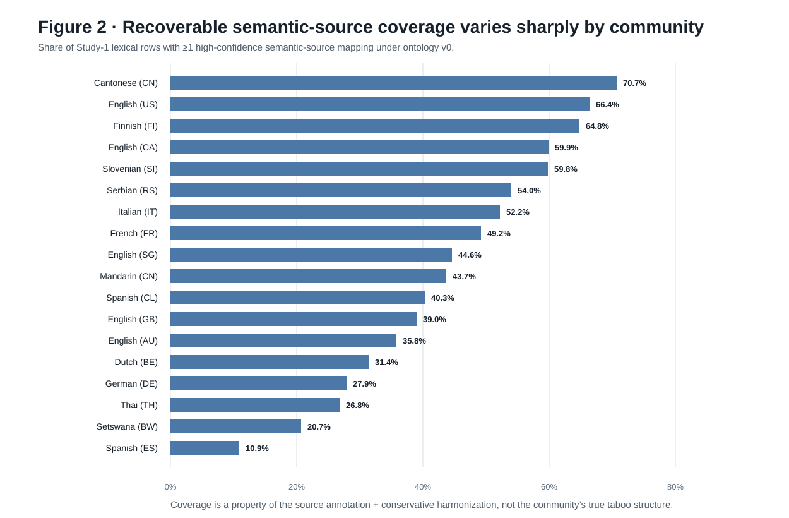
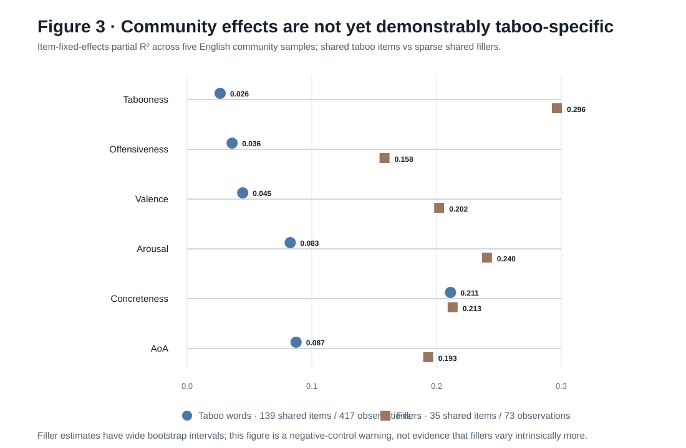

# The Global Grammar of Swearing:
## Measurement Equivalence, Lexical Stability, and Community Variation in Cross-Linguistic Taboo Language

**Working manuscript · ARIS4C016 · 2026-09-18**

### Abstract

Taboo language is widespread across human societies, yet cross-linguistic
comparisons face a basic measurement problem: different research sites may
not mean or annotate the same thing by a "swear word." We use the open
multi-laboratory dataset of Sulpizio et al. (2024), comprising 18 community
samples, 17 countries and 13 languages, as a test bed for a
measurement-first framework for comparative taboo-language research. A
structural audit of 8,190 Study-1 lexical rows reveals large differences in
elicitation yield, primary-category missingness and multi-label annotation
across sites. The source category field also mixes semantic domains
(e.g., sexual or scatological reference), pragmatic functions (e.g., insult)
and socially targeted categories (e.g., slur), preventing direct
interpretation of raw category proportions as cultural differences. We
therefore introduce a provenance-preserving multi-axis ontology and a
reliability protocol that separates semantic source, target, pragmatic
function, social-indexical basis, mechanism and linguistic form. Linking the
18 community samples to Glottolog shows that they represent 13 languages and
only five top-level language families, with 8 of 13 languages
Indo-European, further limiting naïve claims of global universality. In the
strongest repeated-language design, 139 lexical items are shared across at
least two of five English-speaking communities. Item-fixed-effects models
show that community explains modest additional variance in taboo ratings
after lexical identity is held fixed (partial R² = .027 for tabooness and
.036 for offensiveness), while item identity remains dominant. Together,
these results support a stable-core-plus-contextual-modulation account and
show that annotation equivalence, lexical identity and genealogy must be
modeled before constructing global taboo-language profiles. We outline a
reliability-gated Global Swearing Atlas and preregisterable tests of semantic
and phonological generality.

**Keywords:** taboo language; swearing; profanity; cross-linguistic
comparison; measurement invariance; sociolinguistics; linguistic typology;
cultural evolution

---

## 1. Introduction

Swearing is both ordinary and socially consequential. Taboo expressions can
signal anger, pain, intimacy, solidarity, aggression, identity and stance,
while communities regulate their use through social norms and, in some
settings, institutional sanctions. The same lexical item may function as an
insult in one context, an intensifier in another, and affiliative banter in a
third. Accordingly, modern taboo-language research spans pragmatics,
sociolinguistics, discourse analysis, psycholinguistics, cognitive semantics
and linguistic anthropology rather than constituting a single lexical
domain.

Cross-linguistic comparison is therefore attractive but difficult. A simple
global word list can answer which expressions researchers or speakers have
provided, but it cannot by itself tell us whether societies differ in their
underlying taboo structure. Observed differences can arise from at least four
sources: genuine community differences, language structure, language
genealogy, and measurement procedures. These sources become especially hard
to separate when one language is sampled in several countries, another
language is sampled only once, and local researchers apply partly different
annotation schemes.

Sulpizio et al. (2024) provided an unusually valuable open resource for
addressing this problem. Their multi-lab study elicited taboo words from more
than one thousand participants across 18 laboratories and later collected
ratings of lexical and affective properties. The project was designed
bottom-up and openly shares its data and analysis scripts. It therefore
offers an ideal foundation for asking a second-order question that is
necessary before a larger global atlas can be scientifically interpretable:

> When cross-language taboo inventories differ, how much of that difference
> reflects the phenomenon and how much reflects the measurement system?

The present project takes a measurement-first approach. We first audit the
comparability of the source annotations. We then separate lexical item,
community sample, language and language family. Finally, we exploit repeated
English-language items to estimate community-associated variation while
holding lexical identity fixed.

Our central proposal is not that taboo language is either universal or
culture-specific. Instead, we test a **stable core plus contextual
modulation** model: some properties should be strongly constrained by lexical
identity and recurrent taboo domains, while other properties should vary
across communities, contexts and historical settings.

**Figure 1.** Measurement-first workflow. Annotation, ontology reliability,
lexical identity and genealogy are treated as inferential gates before a
cross-community atlas is interpreted.

---

## 2. Prior work and novelty boundary

Descriptive cross-cultural typologies of swearing are not new. Ljung (2011)
developed a linguistic typology and compared English with approximately two
dozen other languages. Jay (2009) emphasized the ubiquity and functional
utility of taboo words and proposed a neuro-psycho-social framework.
The Oxford Handbook of Taboo Words and Language (Allan, 2019) treats taboo as
context-, community- and time-dependent language behavior rather than a
context-free property of strings.

More recently, Lev-Ari and McKay (2023) reported a candidate
cross-linguistic phonological regularity: swear words appear relatively less
likely to contain approximants, and speakers were less likely to judge
approximant-containing pseudowords as swear-like. Sulpizio et al. (2024)
provided the broadest directly relevant open multi-lab lexical/rating
resource for the current analysis.

Accordingly, the present contribution does **not** claim novelty for a global
swear-word inventory, a general typology of swearing, the idea that taboo is
context-sensitive, or the approximant hypothesis. The candidate contribution
is methodological and empirical: a framework that makes annotation
non-equivalence, repeated language samples, lexical identity and genealogy
visible before cultural interpretation.

---

## 3. Data and provenance

### 3.1 Source dataset

We use the openly shared data from Sulpizio et al. (2024). All source files
are accessed from OSF through recorded file GUIDs and verified against
SHA-256 hashes before analysis. Because the OSF project page does not display
a project-level license, ARIS4C016 currently stores provenance, hashes and
analysis code rather than vendoring the raw third-party files.

Study 1 contains 8,190 lexical rows across 18 community samples. The source
columns include the elicited lexical form, optional transcription and English
translation, up to three category fields, the number of participants who
generated the form, and the corresponding percentage.

Study 2 contains 4,240 rows with aggregate ratings including tabooness,
offensiveness, valence, arousal, concreteness and age of acquisition, along
with corpus-frequency information and sex-stratified ratings.

### 3.2 Community, language and genealogy

The 18 community samples correspond to 13 unique Glottolog languages in 17
countries. English is sampled in Australia, Canada, Great Britain, Singapore
and the United States; Spanish is sampled in Chile and Spain. China contains
two language samples, Cantonese/Yue and Mandarin.

The 13 languages belong to only five top-level Glottolog families, and 8 of
13 are Indo-European. We therefore treat "18 samples" and "13 languages" as
different units and do not interpret the dataset as 18 independent language
replications.

---

## 4. Study 1: measurement audit

### 4.1 Elicitation yield

The number of generated expressions per participant differs strongly across
samples. At the low end, Mandarin yields approximately 9.3 recorded
productions per participant; at the high end, German yields approximately
52.9. Such differences can reflect task interpretation, lexical productivity,
cleaning rules, participation behavior or local boundaries between taboo,
rudeness and insult. Raw inventory size is therefore not a direct measure of
a community's propensity to swear.

### 4.2 Annotation missingness

Primary-category missingness is close to zero in several samples but reaches
approximately 67.6% for Setswana and 80.4% for Spanish (Spain). The rate of
rows carrying multiple category labels likewise varies sharply across sites,
from a few percent in some samples to more than half in others.

This degree of heterogeneity means that raw category prevalence mixes
substantive linguistic variation with annotation behavior.

### 4.3 Ontological non-equivalence

The source category field contains broad labels such as *insult*, *slur*,
*sexual*, *scatological* and *blasphemy*, together with numerous local or
more specific categories. These labels do not occupy one logical level.

For example:

- *sexual* is primarily a semantic source;
- *insult* is primarily a pragmatic function;
- *slur* is primarily a socially targeted/indexical category;
- *blasphemy* combines a sacred semantic domain with a transgressive
  mechanism.

A flat mutually exclusive taxonomy therefore loses structure and encourages
site-specific coding practices.

### 4.4 Multi-axis ontology

We introduce separate axes for:

1. semantic taboo source;
2. target;
3. pragmatic function;
4. social-indexical basis;
5. taboo/derogation mechanism;
6. linguistic form.

Mappings preserve the original labels, carry confidence levels and allow
multiple values. Ambiguous local labels are retained as unresolved rather
than forced into a global "other" category.

A conservative first-pass mapping covers roughly 80% of non-empty source
label occurrences, but this apparent coverage masks large row-level
differences because some communities have many unannotated rows.

---

## 5. Failed naïve Taboo Fingerprint

We attempted to construct semantic fingerprints using only high-confidence
mappings from the original source labels. This attempt failed a measurement
comparability check.

Semantic-source row coverage ranges from approximately 10.9% in Spanish
(Spain) and 20.7% in Setswana to 70.7% in Cantonese. Moreover, the recoverable
semantic subset is structurally selective. Labels such as *sexual* reveal a
semantic source directly, whereas rows labeled only *insult* or *slur* do not
reveal whether their derogatory content concerns sex, kinship, intelligence,
appearance, animals, identity or another domain.

Consequently, the apparent predominance of sexual categories in the mapped
subset cannot yet be interpreted as a global cultural pattern. The failure is
substantive: a valid Taboo Fingerprint requires independent re-coding of
lexical items onto orthogonal axes.

**Figure 2.** Recoverable semantic-source coverage under the conservative
ontology-v0 mapping. The large cross-site range is itself a measurement result
and prevents naïve comparison of raw semantic proportions.

---

## 6. Study 2: repeated-language community variation

### 6.1 Rationale

Most cross-language comparisons confound lexical identity with community.
The English subset offers a stronger design because identical lexical forms
can be compared across several communities.

Among non-filler Study-2 rows, 139 English lexical items occur in at least two
of the five English community samples. Twenty-three occur in all five.

### 6.2 Descriptive stability

Pairwise correlations for shared English items are generally strong but not
perfect. For example, tabooness correlations are approximately .89 between
Australia and the United States and .87 between Canada and the United States,
while Canada and Singapore are lower at approximately .67.

This suggests substantial lexical stability together with community-specific
variation.

### 6.3 Item-fixed-effects model

We estimate a fixed-effects model using the
Frisch–Waugh–Lovell decomposition. Lexical-item fixed effects are removed
first; community indicators are then estimated on the residualized outcome.
Uncertainty is assessed with 500 bootstrap resamples over lexical items.

For 417 item × community aggregate-rating observations:

| Outcome | Community partial R² after item FE | Item-bootstrap 95% interval |
|---|---:|---:|
| Tabooness | .0265 | .0095–.0837 |
| Offensiveness | .0361 | .0125–.1045 |
| Valence | .0446 | .0173–.1150 |
| Arousal | .0827 | .0384–.1689 |
| Concreteness | .2112 | .1198–.3105 |
| Age of acquisition | .0874 | .0347–.1783 |

The main result is not that communities are interchangeable. Rather, lexical
identity dominates taboo-specific ratings, while a modest community main
effect remains.

A useful negative control is concreteness: community explains substantially
more residual variation in concreteness than in tabooness or offensiveness.
This warns against interpreting every cross-community rating difference as a
specific taboo-cultural effect.

### 6.4 Balanced-item sensitivity and filler negative control

The primary model is unbalanced because many lexical items occur in only two
to four English community samples. We therefore repeated the item-fixed-effects
analysis on the 23 taboo items observed in all five English communities
(115 item × community observations). Community partial R² remained non-zero
and was somewhat larger for the taboo-specific outcomes: .0537 for tabooness
and .0532 for offensiveness. The corresponding item-bootstrap intervals were
wide (.0273–.1941 and .0128–.2373), as expected from the much smaller balanced
subset. Thus the qualitative finding does not depend on partially shared items,
but the balanced subset does not support a more precise effect estimate.

More importantly, we applied the same item-fixed-effects diagnostic to shared
non-taboo filler words. The filler design is sparse—35 shared lexical items,
73 item × community observations, and no item represented in all five
communities—but community effects were larger rather than smaller:
partial R² = .2965 for tabooness ratings and .1583 for offensiveness ratings,
with similarly elevated estimates for valence, arousal, concreteness and age
of acquisition.

This negative control changes the interpretation of the repeated-language
result. The current data establish that aggregate lexical ratings are
community-sensitive after item identity is controlled, but they do **not**
establish that the community effect is specific to taboo language. Participant
composition, rating-scale calibration, procedure, dialect/register, lexical
sampling and other site-level factors can generate community-associated
variation in both taboo and neutral items. A stronger confirmatory design
therefore requires matched taboo/neutral items with comparable community
coverage and an explicit taboo-status × community interaction.

**Figure 3.** Community-associated residual variation after controlling lexical
item identity. The sparse filler control shows that community effects are not
yet demonstrably taboo-specific; its uncertainty is correspondingly large.

---

## 7. Reliability gate

Before semantic prevalence comparisons, approximately 300 Study-1 lexical
rows will be sampled deterministically across all communities, with deliberate
oversampling of:

- missing-category rows;
- unresolved labels;
- multi-label rows;
- low-coverage communities.

Two independent coders will assign the multi-axis ontology. Public audit
artifacts use row hashes rather than publishing the taboo expressions
themselves.

Agreement will be reported using exact-set agreement, Jaccard similarity and
labelwise binary agreement coefficients. Disagreements will be frozen before
adjudication so that ontology revisions remain auditable.

Axes that do not demonstrate reproducible coding will remain exploratory.

---

## 8. Phonological validation track

The source `transcription` field cannot support a global phonological test:
it is populated almost entirely for Cantonese and Mandarin. We therefore
propose an independent pronunciation layer using language-specific G2P/IPA
resources with native-language validation.

The primary preregistered phonological replication will test the previously
reported approximant hypothesis against within-language matched neutral
controls. Other phonological classes will remain exploratory unless
independently preregistered.

PHOIBLE can provide standardized inventory and distinctive-feature
information, while pronunciation generation requires word-level resources
such as Epitran-supported language/script pipelines. Pronunciation failures,
slang, code-switching and multi-word expressions must be audited because G2P
error is unlikely to be random with respect to taboo vocabulary.

---

## 9. Discussion

### 9.1 Stable core plus contextual modulation

The repeated-item English analysis rejects a simple dichotomy between
universal and culture-specific swearing. The same taboo words retain
substantial relative stability across English-speaking communities, yet their
ratings are not identical. A useful model therefore distinguishes stable
lexical structure from contextual modulation.

### 9.2 Annotation is part of the data-generating process

The largest immediate threat to a global semantic atlas is not statistical
power but measurement equivalence. If one site uses semantic labels, another
uses pragmatic labels and a third leaves many rows uncoded, a map of category
proportions can become a map of annotation protocols.

Comparative taboo-language research should therefore treat annotation
coverage and ontology provenance as first-class variables.

### 9.3 "Global" requires genealogical diversity

Thirteen languages are substantially broader than a single-language study,
but the current set is still dominated by Indo-European languages and contains
only five top-level families. Strong claims of universality require held-out
family replication and broader sampling.

### 9.4 Atlas as evidence interface, not decoration

A future Global Swearing Atlas should display uncertainty, unresolved
content, annotation coverage, language identity and sample provenance. Its
purpose is not to produce country rankings but to make the evidence structure
inspectable.

---

## 10. Current limitations

The present results are Phase-0 analyses of aggregate open data.

Important limitations include:

- no independent dual-coder ontology results yet;
- community samples differ demographically and procedurally;
- Study-2 ratings are aggregate item estimates rather than participant-level
  observations in our current analysis;
- repeated-language identification is strong mainly for English;
- language-family diversity is limited;
- the flat source taxonomy prevents direct recovery of semantic content for
  many insult/slur rows;
- phonological data require a new standardized pronunciation layer.

---

## 11. Planned confirmatory analyses

The next promotion gates are:

1. independent ontology coding and reliability;
2. measurement-corrected semantic fingerprints;
3. English ontology × community repeated-item models;
4. missing/unresolved-content sensitivity bounds;
5. genealogy-aware cross-language tests;
6. preregistered approximant replication with matched controls;
7. expanded crossed language × country sampling.

---

## References — working set

Allan, K. (Ed.). (2019). *The Oxford Handbook of Taboo Words and Language*.
Oxford University Press.

Crespo-Fernández, E. (2025). Taboo language research in the new millennium:
A literature review. *Complutense Journal of English Studies, 33*.
https://doi.org/10.5209/cjes.102066

Jay, T. (2009). The utility and ubiquity of taboo words.
*Perspectives on Psychological Science, 4*(2).
https://doi.org/10.1111/j.1745-6924.2009.01115.x

Lev-Ari, S., & McKay, R. (2023). The sound of swearing: Are there universal
patterns in profanity? *Psychonomic Bulletin & Review, 30*, 1103–1114.
https://doi.org/10.3758/s13423-022-02202-0

Ljung, M. (2011). *Swearing: A Cross-Cultural Linguistic Study*.
Palgrave Macmillan.

Miller, L. (2022). Bad Mouths: Taboo and Transgressive Language.
*Annual Review of Anthropology, 51*, 17–30.

Sulpizio, S., et al. (2024). Taboo language across the globe: A multi-lab
study. *Behavior Research Methods, 56*, 3794–3813.
https://doi.org/10.3758/s13428-024-02376-6
